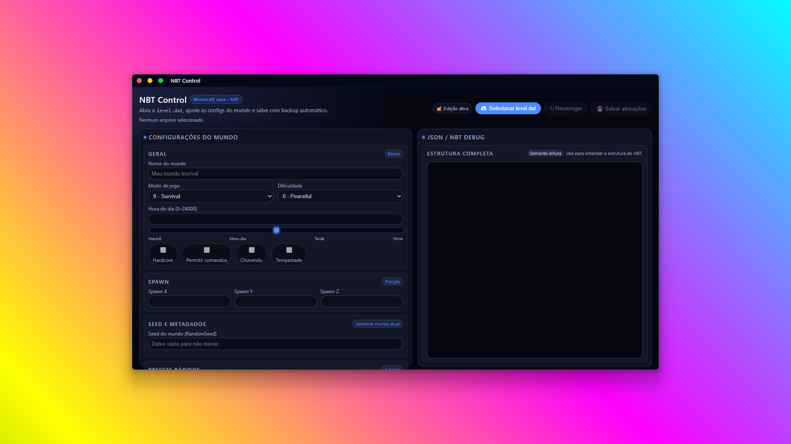
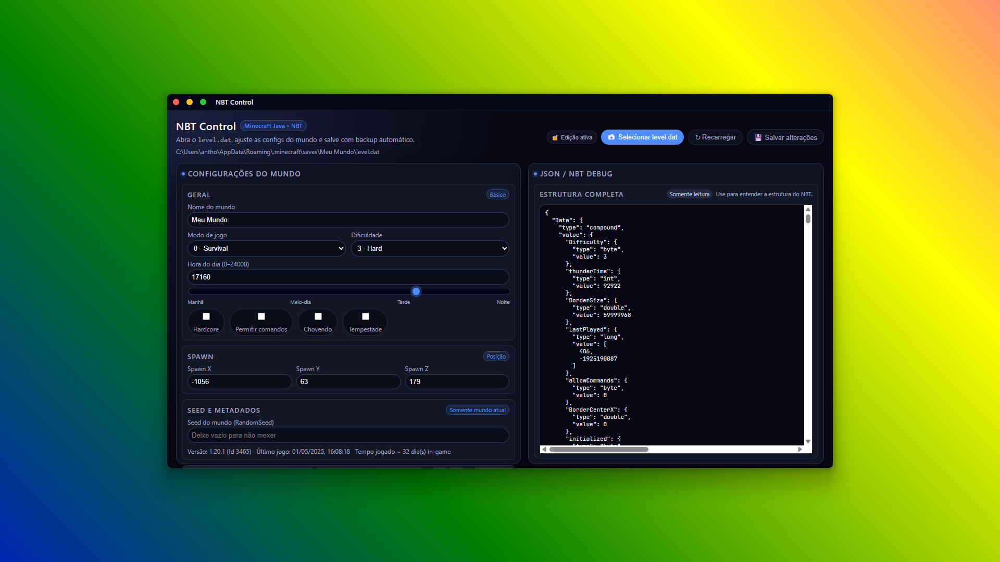

  

<h1 align="center">NBT Control</h1>

  A simple Electron desktop app to inspect and edit <code>level.dat</code> files from Minecraft Java Edition worlds.

  

  

---

With NBT Control you can quickly tweak world settings like game mode, difficulty, time of day, spawn point and more, without needing to open the game or touch NBT editors manually.

> ⚠️ Always keep backups of your worlds. NBT Control is designed to create a backup before saving, but you should still be careful when editing `level.dat`.

---

## Features

- 🔍 **Open `level.dat` from a Minecraft world**

  - Uses a native file picker to select the `level.dat` file.
  - Shows the full NBT structure as JSON in a read-only panel.

- 🎮 **Edit basic world settings**

  - World name (`LevelName`)
  - Game mode (`GameType`): Survival, Creative, Adventure, Spectator
  - Difficulty (`Difficulty`): Peaceful, Easy, Normal, Hard
  - Hardcore mode (`hardcore` flag)
  - Allow commands (`allowCommands`)
  - Weather flags: raining / thundering (`raining`, `thundering`)

- ☀️ **Time of day control**

  - Edit `DayTime` using a numeric input (`0–24000`)
  - Linked **slider** for a more visual control (morning / noon / evening / night)
  - Internally handled as a `long` with proper high/low part reconstruction

- 📍 **Spawn point editor**

  - Edit `SpawnX`, `SpawnY`, `SpawnZ` directly.

- 🌱 **World seed (RandomSeed)**

  - Optional override of `RandomSeed` if you enter a value.
  - If left empty, the seed is not modified.

- 📊 **Metadata & info**

  - Shows version (`Version.Name`, `Version.Id`) if present.
  - Shows last played date (`LastPlayed`) converted from the full 64-bit long.
  - Shows approximate **in-game days played** based on `Time` ticks (`Time / 24000`).

- ⚡ **Quick presets**

  - ☀️ Creative, sunny day with commands enabled
  - 🌩 Survival hard at night with storm and hardcore
  - 🧪 Test world: creative, peaceful, noon, central elevated spawn

- 🛡️ **Read-only mode**

  - Toggle **“Edição ativa / Somente leitura”**:
    - When **read-only** is on, all editing controls and the save button are disabled.
    - Great to just inspect `level.dat` safely.

- 💾 **Safe saving with backup**

  - Before writing the new `level.dat`, the app creates a backup file in the same folder.
  - Edits are applied to the in-memory NBT structure and then written back.

- 🔔 **Status toast**
  - Floating status panel in the top-right:
    - Success (green)
    - Error (red)
    - Informational / idle messages
  - Auto-hides for non-error messages.

---

## Tech stack

- **Electron** (desktop wrapper)
- **Node.js** runtime
- Plain **JavaScript** for main, preload and renderer
- An NBT parsing library to read/write `level.dat` (exposed via `window.mcApi` in `preload.js`)
- Vanilla HTML/CSS for the UI (no framework)
